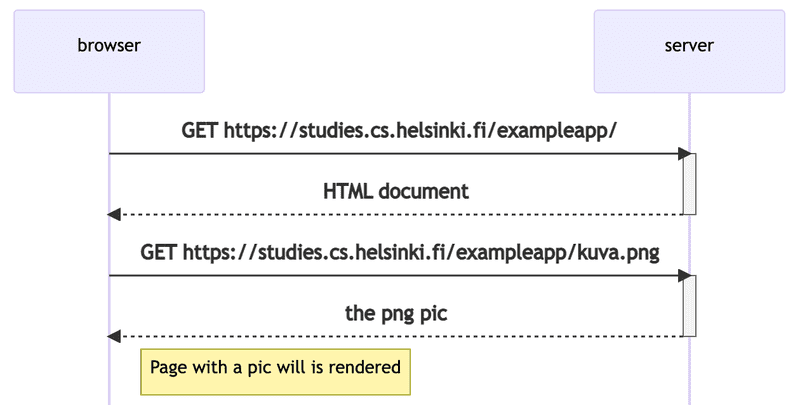

# part0 – Fundamentals of Web apps

## Reference
https://fullstackopen.com/en/part0/fundamentals_of_web_apps 
https://studies.cs.helsinki.fi/exampleapp/notes
 
## HTTP sequence diagram


## JS

```
xhttp.onreadystatechange = function() {
  if (this.readyState == 4 && this.status == 200) {
    // code that takes care of the server response
  }
}
```

The mechanism of invoking event handlers is very common in JavaScript. Event handler functions are called callback functions.

## Document Object Model or DOM

The functioning of the browser is based on the idea of depicting HTML elements as a tree.

Document Object Model, or DOM, is an Application Programming Interface (API) that enables programmatic modification of the element trees corresponding to web pages.

## CSS

The file defines two class selectors. These are used to select certain parts of the page and to define styling rules to style them.

A class selector definition always starts with a period and contains the name of the class.

Classes are attributes, which can be added to HTML elements.

# Loading a page containing JavaScript - review


## AJAX

The Notes page of the application follows an early-nineties style of web development and uses "Ajax". As such, it's on the crest of the wave of early 2000s web technology.

AJAX (Asynchronous JavaScript and XML) is a term introduced in February 2005 on the back of advancements in browser technology to describe a new revolutionary approach that enabled the fetching of content to web pages using JavaScript included within the HTML, without the need to rerender the page.

Before the AJAX era, all web pages worked like the traditional web application we saw earlier in this chapter. All of the data shown on the page was fetched with the HTML code generated by the server.

The Notes page uses AJAX to fetch the notes data. Submitting the form still uses the traditional mechanism of submitting web forms.

The application URLs reflect the old, carefree times. JSON data is fetched from the URL https://studies.cs.helsinki.fi/exampleapp/data.json and new notes are sent to the URL https://studies.cs.helsinki.fi/exampleapp/new_note. Nowadays URLs like these would not be considered acceptable, as they don't follow the generally acknowledged conventions of RESTful APIs, which we'll look into more in part 3.

The thing termed AJAX is now so commonplace that it's taken for granted. The term has faded into oblivion, and the new generation has not even heard of it.

## Single page app

https://studies.cs.helsinki.fi/exampleapp/spa

In recent years, the Single-page application (SPA) style of creating web applications has emerged. SPA-style websites don't fetch all of their pages separately from the server like our sample application does, but instead comprise only one HTML page fetched from the server, the contents of which are manipulated with JavaScript that executes in the browser.

## Javascript libraries
- jQuery - kinda outdated
- Angular was popular, but got depricated
- React and Redux are popular
- VueJS is up and coming

## Full-stack web development


What does the name of the course, Full stack web development, mean? Full stack is a buzzword that everyone talks about, but no one knows what it means. Or at least, there is no agreed-upon definition for the term.

Practically all web applications have (at least) two "layers": the browser, being closer to the end-user, is the top layer, and the server the bottom one. There is often also a database layer below the server. We can therefore think of the architecture of a web application as a stack of layers.

Often, we also talk about the frontend and the backend. The browser is the frontend, and the JavaScript that runs on the browser is the frontend code. The server on the other hand is the backend.

In the context of this course, full-stack web development means that we focus on all parts of the application: the frontend, the backend, and the database. Sometimes the software on the server and its operating system are seen as parts of the stack, but we won't go into those.

We will code the backend with JavaScript, using the Node.js runtime environment. Using the same programming language on multiple layers of the stack gives full-stack web development a whole new dimension. However, it's not a requirement of full-stack web development to use the same programming language (JavaScript) for all layers of the stack.

It used to be more common for developers to specialize in one layer of the stack, for example, the backend. Technologies on the backend and the frontend were quite different. With the Full stack trend, it has become common for developers to be proficient in all layers of the application and the database. Oftentimes, full-stack developers must also have enough configuration and administration skills to operate their applications, for example, in the cloud.

## JavaScript fatigue

Full-stack web development is challenging in many ways. Things are happening in many places at once, and debugging is quite a bit harder than with regular desktop applications. JavaScript does not always work as you'd expect it to (compared to many other languages), and the asynchronous way its runtime environments work causes all sorts of challenges. Communicating on the web requires knowledge of the HTTP protocol. One must also handle databases and server administration and configuration. It would also be good to know enough CSS to make applications at least somewhat presentable.

The world of JavaScript develops fast, which brings its own set of challenges. Tools, libraries and the language itself are under constant development. Some are starting to get tired of the constant change, and have coined a term for it: JavaScript fatigue. See How to Manage JavaScript Fatigue on auth0 or JavaScript fatigue on Medium.

You will suffer from JavaScript fatigue yourself during this course. Fortunately for us, there are a few ways to smooth the learning curve, and we can start with coding instead of configuration. We can't avoid configuration completely, but we can merrily push ahead in the next few weeks while avoiding the worst of configuration hells.