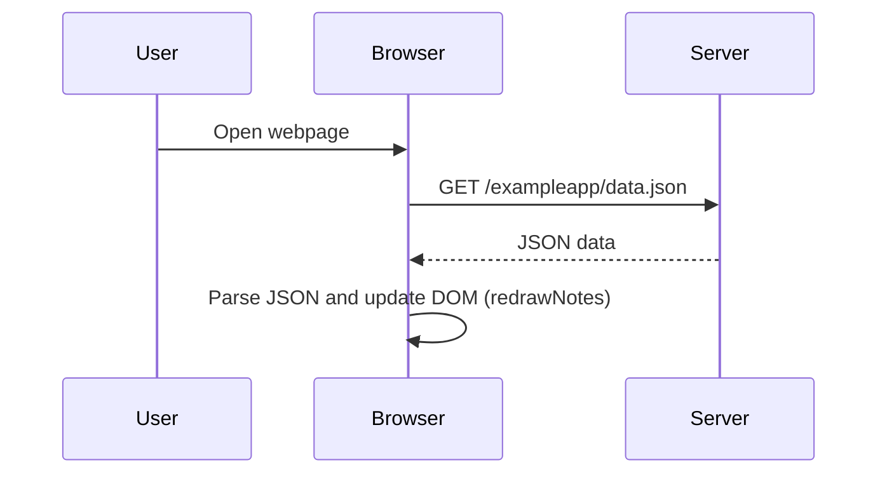

```mermaid
sequenceDiagram
    participant User
    participant Browser
    participant Server

    User->>Browser: Open webpage
    Browser->>Server: GET /exampleapp/data.json
    Server-->>Browser: JSON data
    Browser->>Browser: Parse JSON and update DOM (redrawNotes)
```