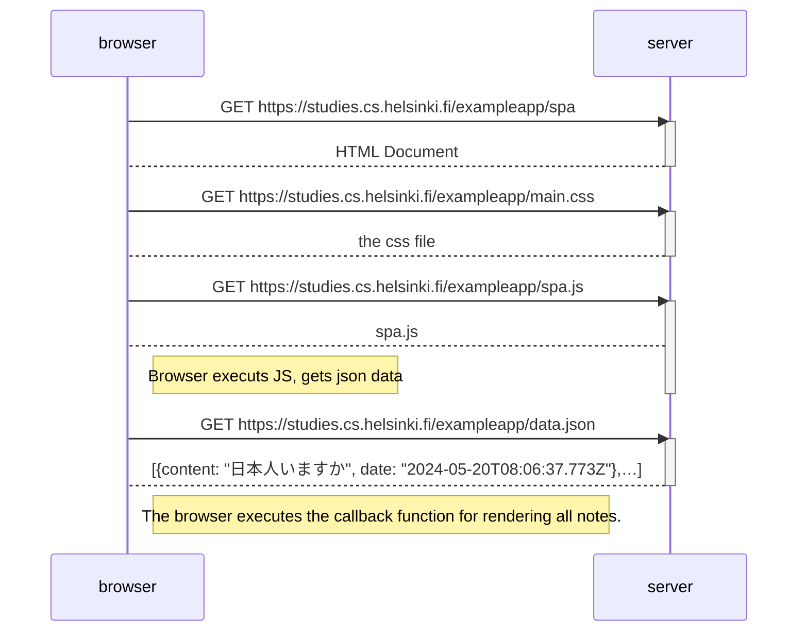

```mermaid
sequenceDiagram
    participant browser
    participant server

    browser->>server: GET https://studies.cs.helsinki.fi/exampleapp/spa
    activate server
    server-->browser: HTML Document 
    deactivate server
    browser->>server: GET https://studies.cs.helsinki.fi/exampleapp/main.css
    activate server
    server-->browser: the css file
    deactivate server
    browser->>server: GET https://studies.cs.helsinki.fi/exampleapp/spa.js
    activate server
    server-->browser: spa.js
    Note right of browser: Browser executs JS, gets json data
    deactivate server
    browser->>server: GET https://studies.cs.helsinki.fi/exampleapp/data.json
    activate server
    server-->browser: [{content: "日本人いますか", date: "2024-05-20T08:06:37.773Z"},…] 
    deactivate server
    Note right of browser: The browser executes the callback function for rendering all notes.
```